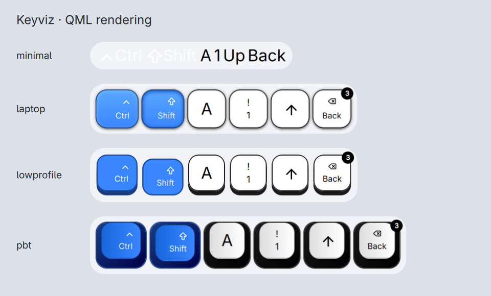

# Keystrokes

**A keystroke and mouse-action overlay for [DankMaterialShell](https://github.com/AvengeMedia/DankMaterialShell)** — draws your keypresses on screen while you record a screencast.

## Install

```bash
git clone https://github.com/Tz-slayer/keystrokes.git \
  ~/.config/DankMaterialShell/plugins/keystrokes
```

Then enable it in DMS. Because it reads input devices directly, your user must be in the `input` group and the libinput CLI has to be installed:

```bash
sudo usermod -aG input $USER     # then log out and back in
sudo pacman -S libinput          # Arch
```

`evtest` is optional — a fallback for single-device mode when the libinput CLI is unavailable.

## What it does

- **Combinations and single keys.** `Ctrl + Shift + S` is one row; typed letters appear individually.
- **Four keycap skins** ported 1:1 from keyviz — minimal, laptop, low profile and PBT. See [Keycap styles](#keycap-styles).
- **Real press feedback**, with a badge counting repeats while you hold or hammer a key.
- **Five animations** (none / fade / zoom / float / slide), any position on any display, independent X/Y margins.
- **Full colour control** — separate normal and modifier colours, gradients, fractional border widths and radii.
- **Filtering** — every key, hotkeys only, or your own list of allowed keys.
- Mouse clicks, drags and wheel as keycaps (off by default), and a mute keycap that knows the real sink state.

## Keycap styles



All four are straight ports of keyviz's keycap components, so the geometry is keyviz's rather than an approximation. Pick one in settings — **Low Profile** is the default. Choosing **Minimal** also switches to icon labels and turns off modifier highlighting, matching what keyviz does there.

The skin supplies the *geometry*, your colour settings supply every *colour*, so one set of colours renders all four consistently.

## Settings

Everything is on one page, reached from the plugin's settings icon in the DMS Control Center.

- **Filtering & History** — show every key, only hotkeys, or your own comma-separated list of allowed keys; history size and direction; the toggle shortcut.
- **Display & Margins** — which output to draw on, and the margins. Following the focused output is the default.
- **Colors & Border** — colours, gradients, border width and corner radius.
- **Color Presets** — 14 upstream palettes, plus style randomization.
- **Layout & Animations** — position, skin, animation and duration.
- **Keycap Content** — label variant, text case, alignment, icons, symbols.
- **Group Background**, **Visibility Options**, **Input Device**, **General Settings**.

Under **Hotkeys** a sequence shows when Ctrl, Shift, Alt, Super or Fn is among its keys — `Ctrl` then `A` and `A` then `Ctrl` both show, and each keycap counts its own presses. Press order does not matter: two keys hit together land in whatever order the kernel reports them, and keyviz's original "first key decides" rule made that a coin flip. Sequences with no modifier at all are still hidden; use **Off** to see every key. **Custom** works the same way against your own comma-separated list instead of the modifier set — physical names like `KEY_RIGHTCTRL` are accepted, and media keys are dropped the way keyviz drops them.

Held keys stay visible until released. Released keys expire individually after the **Fade Timeout** (5000 ms by default), and pressing a key again updates its count rather than adding a new cap.


## Credits

- **[mulaRahul/keyviz](https://github.com/mulaRahul/keyviz)** (MIT)
- **[loccun/dms-screenkey](https://github.com/loccun/dms-screenkey)** (MIT)

## License

MIT — see [LICENSE](LICENSE).